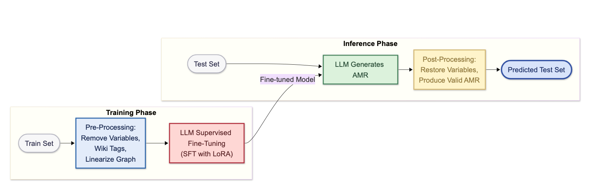
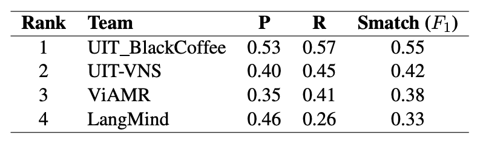
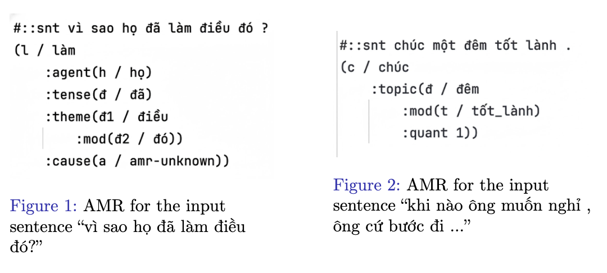
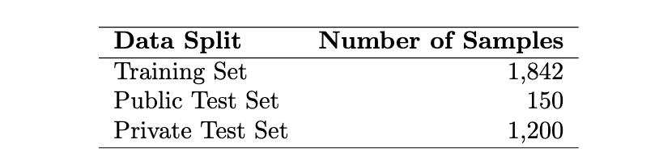
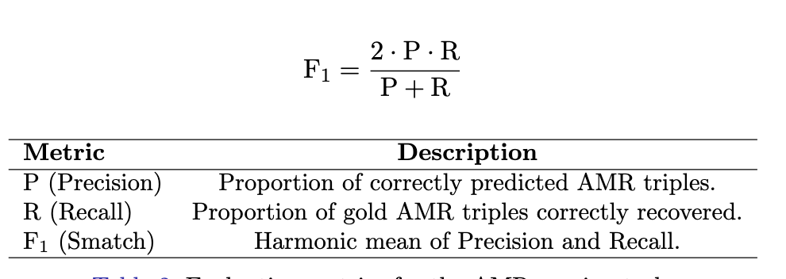
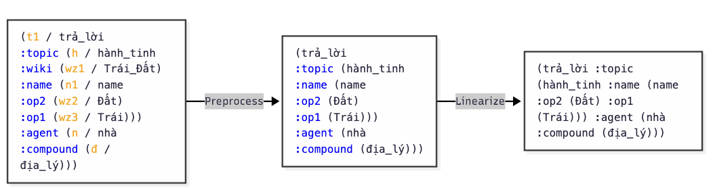
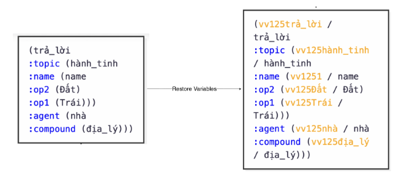
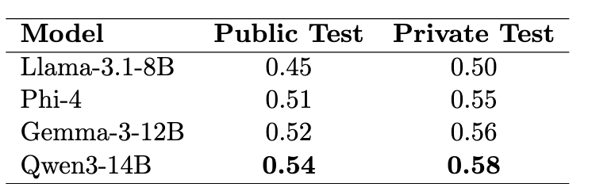

  

<h1 align="center"><b>VLSP2025-SemParse</b></h1>
---
## UIT_BlackCoffe Members
* Ngô Thành Trung 
* Trịnh Quốc Bảo
* Đinh Nhật Trường
* Correspondence: Nguyễn Đức Vũ 

---
## VLSP 2025 Challenge on Semantic Parsing

In this project, we present an empirical study of **Vietnamese AMR Parsing** using LLMs. Our approach combines:

- Pre-processing of training data  
- Post-processing of model outputs  
- Supervised Fine-Tuning (SFT) and LoRA  

With this pipeline, we achieved the **highest scores on both the Public and Private test sets**.

  

<i>Overview of our pipeline</i>

<table align="center">
  <tr>
    <td align="center">
       
      <i>Public leaderboard</i>
    </td>
    <td align="center">
       
      <i>Private leaderboard</i>
    </td>
  </tr>
</table>

Our best model (finetuned Qwen3) is available at [ICTuniverse/VLSP2025-SemParse](https://huggingface.co/ICTuniverse/VLSP2025-SemParse).

---
## Task Description

The goal of the VLSP 2025 Vietnamese AMR Parsing Challenge is to convert Vietnamese sentences into their corresponding Abstract Meaning Representations (AMRs).

  

---
## Dataset
The VLSP 2025 AMR dataset consists of manually annotated Vietnamese sentences paired with their AMR graphs. The dataset is divided into training, public test, and private test sets.

  

<i>Statistics of the VLSP 2025 AMR dataset.</i>

---
## Metrics
The main evaluation metric for the VLSP 2025 Vietnamese AMR Parsing Challenge is the Smatch score. It measures the score of two semantic graphs in terms of their matching triples (edges) by finding a variable (node) mapping that maximizes the count. The Smatch score is reported as the F1-score, calculated as:

  

<i>Evaluation metrics for the AMR parsing task.</i>

---
## Data pre-processing
1. Wiki removal: remove noisy ‘:wiki‘ annotations to avoid mismatches during training.
2. Variable removal: strip variable names (e.g., ‘wz1‘, ‘h‘) so the model
focuses on concepts and relations.
3. Linearization: convert the cleaned graph (PENMAN-style) into a
deterministic linear sequence.

  

<i>(1) raw graph, (2) graph without variables and wiki tags, (3) final linearized input for sequence processing</i>

---
## Data post-processing
1. Variable restoration: Reconstruct valid AMR variables by assigning unique identifiers to each concept node
2. Structure fixing: Repair malformed AMRs by balancing parentheses, restoring missing quotes or parentheses, removing dangling edges and repairs or skips malformed nodes to restore valid AMR structure, and inserting spaces in numeric arguments (e.g., to avoid tokens like :value3 or op123 being misparsed).

  

<i>(1) Non-variable AMR, (2) AMR with restored variables.</i>

---
## Training Strategy
1. Supervised fine-tuning (SFT): we fine-tuned pretrained LLMs on the
Vietnamese AMR dataset using standard supervised learning to align
model outputs with gold AMR graphs.
2. LoRA fine-tuning: applied low-rank adaptation to efficiently update
only small parameter subsets, reducing memory and compute costs while
retaining model performance.
3. Quantization: all models were loaded in 4-bit precision to enable
efficient fine-tuning on limited GPU resources.

---
## Results 

We perform SFT with LoRA for 4 models: Qwen3-14B, Gemma-3-12B, Phi-4 and Llama-3.1-8B.

  

<i>Evaluation of different models using F1-score on the VLSP 2025 AMR public and private test sets with full processing</i>

---
## 📘 Additional Resources

We utilized code from **[RikVN/AMR](https://github.com/RikVN/AMR.git)** to pre-process the training data and post-process the model's outputs. We modified the code to better fit our datasets. For more details, please refer to the `data-processing` folder and read the `Readme.txt` carefully.

